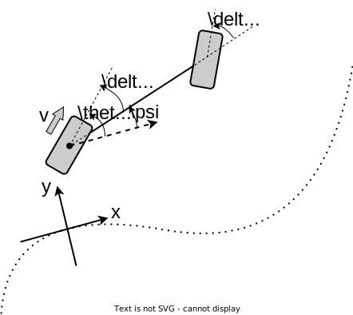

# 4WS-MPC

前輪ステア，後輪ステアの2入力を用いたモデルのモデル予測制御

## 車両モデル[1]

車両モデルは下図のようにフレネ座標系を用い，軌道近傍でのダイナミクスを考慮する．

  

### 変数

|変数|説明|
|:--|:------|
|$L$|ホイールベース長|
|$v$|車両速度|
|$y$|目標軌道に対する横方向の偏差|
|$\delta_f$|前輪ステア角|
|$\delta_r$|後輪ステア角|
|$\delta_{fdes}$|前輪ステア目標値|
|$\delta_{rdes}$|後輪ステア目標値|
|$\tau$|タイヤ遅れの時定数|
|$\psi$|軌道に対する車両の姿勢角|
|$\beta$|車両から見た速度方向の角度|
|$\theta$|代替変数:$\psi+\beta$|
|$\kappa_r$|目標軌道の曲率|

### ダイナミクス

状態方程式

$$
\begin{align}
\begin{aligned}
    \dot y=&v\sin(\psi+\beta)=v\sin\theta\\
    \dot \theta=&\frac{v\cos\beta(\tan\delta_f-\tan\delta_r)}{L}-\kappa_r v\cos\theta\\
    &-\tau^{-1}
    \left(
    \frac{\partial \beta}{\partial \delta_f}(\delta_f - \delta_{fdes})
    +\frac{\partial \beta}{\partial \delta_r}(\delta_r - \delta_{rdes})
    \right).\\
    \dot{\delta_f}=&-\tau^{-1}(\delta_f - \delta_{fdes})\\
    \dot{\delta_r}=&-\tau^{-1}(\delta_r - \delta_{rdes}).
\end{aligned}
\end{align}
$$

以上をまとめて，

$$
\begin{align}
    \boldsymbol{\dot x}&=f(\boldsymbol x,u).
\end{align}
$$

出力方程式

$$
\boldsymbol y=h(\boldsymbol x)=
\begin{bmatrix}
y\\ \psi\\
\end{bmatrix}
=\begin{bmatrix}
y\\
\theta-\beta\\
\end{bmatrix}
=\begin{bmatrix}
y\\
\theta-\delta_r\\
\end{bmatrix}.
$$

## 近似線形化

### リファレンス入力

目標軌道の曲率$\kappa_r$，および姿勢$\beta_r$から，ステア角が以下のように定まる．[2]

$$
\begin{align}
\begin{aligned}
    \delta_{fr}&=\arctan{\left(\frac{\sin\beta_r+L\kappa_r}{\cos\beta_r}\right)}\\
    \delta_{rr}&=\beta_r
\end{aligned}
\end{align}
$$

### 線形化

状態方程式について，$y=0,\theta=0,\delta_f=\delta_{fr},\delta_r=\delta_{rr}$の周りで近似線形化を行う．線形化後の状態方程式は以下のように書ける．

$$
\begin{align}
\begin{aligned}
    \dot{\boldsymbol{x}}&=A\boldsymbol{x}+Bu+w\\
    \boldsymbol{y}&=C\boldsymbol{x}
\end{aligned}
\end{align}
$$

$$
\begin{align}
    A
    =&
\begin{bmatrix}
0&v&0&0\\
0&0&A_{23}&A_{24}\\
0&0&-1/\tau&0\\
0&0&0&-1/\tau
\end{bmatrix}\\
    A_{23}=&\frac{v\,{\left({\mathrm{tan}\left(\mathrm{\delta_{fr}}\right)}^2 +1\right)}}{L\,\sqrt{{\mathrm{tan}\left(\mathrm{\delta_{rr}}\right)}^2 +1}}\\
    A_{24}=&-\frac{\mathrm{\tau}\,v+L\,\sqrt{{\mathrm{tan}\left(\mathrm{\delta_{rr}}\right)}^2 +1}+\mathrm{\tau}\,v\,\mathrm{tan}\left(\mathrm{\delta_{fr}}\right)\,\mathrm{tan}\left(\mathrm{\delta_{rr}}\right)}{L\,\mathrm{\tau}\,\sqrt{{\mathrm{tan}\left(\mathrm{\delta_{rr}}\right)}^2 +1}}\\
    B=&
    \left(\begin{array}{cc}
0 & 0\\
0 & 0\\
\frac{1}{\tau } & 0\\
0 & \frac{1}{\tau }
\end{array}\right)\\
    w=&\left(\begin{array}{c}
0\\
w_2\\
0\\
0
\end{array}\right)\\
w_2=&
\frac{v\,{\left(\mathrm{tan}\left(\mathrm{\delta_{fr}}\right)-\mathrm{tan}\left(\mathrm{\delta_{rr}}\right)\right)}}{L\,\sqrt{{\mathrm{tan}\left(\mathrm{\delta_{rr}}\right)}^2 +1} }-\mathrm{kd}\,v-\frac{\mathrm{\delta_{fr}}\,v\,{\left({\mathrm{tan}\left(\mathrm{\delta_{fr}}\right)}^2 +1\right)}}{L\,\sqrt{{\mathrm{tan}\left(\mathrm{\delta_{rr}}\right)}^2 +1}}\\
&+\frac{\mathrm{\delta_{rr}}\,{\left(\tau\,v+L\,\sqrt{{\mathrm{tan}\left(\mathrm{\delta_{rr}}\right)}^2 +1} +\tau\,v\,\mathrm{tan}\left(\mathrm{\delta_{fr}}\right)\,\mathrm{tan}\left(\mathrm{\delta_{rr}}\right)\right)}}{L\,\tau\,\sqrt{{\mathrm{tan}\left(\mathrm{\delta_{rr}}\right)}^2 +1}}\\
\mathrm{}\\
    C=&
    \left(\begin{array}{cccc}
    1 & 0 & 0 & 0\\
    0 & 1 & 0 & -1
    \end{array}\right).
\end{align}
$$

## モデルの実装

### 変数

|変数名|型|対応変数|説明|
|:--|:--|:--|:--|
|m_wheelbase|float64_t|$L$|ホイールベース長|
|velocity|float64_t|$v$|車両速度|
|m_steer_lim|float64_t|-|ステア角のリミット|
|m_steer_tau|float64_t|$\tau$|タイヤ遅れの時定数|
|delta_fr|float64_t|$\delta_{fr}$|前輪ステアリファレンス入力|
|delta_rr|float64_t|$\delta_{rr}$|後輪ステアリファレンス入力|
|m_posture|float64_t|-|軌道から見た目標姿勢|
|beta_r|float64_t|$\beta_r$|車両から見た目標姿勢(=-m_posture)|
|kappa_r|float64_t|$\kappa_r$|目標軌道の曲率|

## MPC

### 評価関数

以下の形の評価関数がベースとなる．ここで，$Q,R$は2x2の対角行列．

$$
J= (y-y_{ref})^TQ(y-y_{ref})+(u-u_{ref})^TR(u-u_{ref})
$$

### 設計パラメータ

|パラメータ|説明|
|:--|:--|
|$Q(0,0)$|目標軌道に対する横方向偏差の重み付け|
|$Q(1,1)$|目標姿勢角に対する偏差の重み付け|
|$R(0,0)$|前輪ステア角のリファレンス入力からの偏差に対する重み付け|
|$R(1,1)$|後輪ステア角のリファレンス入力からの偏差に対する重み付け|

## 備考

- 車両モデルがノンホロノミック拘束を持っていることに注意をしなくてはならない．この拘束により，車両が姿勢を変える際にはy方向偏差の発生を伴う．
- すなわち，目標軌道と目標姿勢の組み合わせによっては実現不可能なものが存在する．（例：姿勢を変えながら直進することは不可能．）
- リファレンス入力はあくまで瞬間的に目標の軌道と姿勢を実現するものである．そのため，上記のノンホロノミック拘束の都合から，リファレンス入力を用いても大域的な目標軌道と姿勢への追従は保証されない．
- 上記の問題に対して以下のような検討が必要だと思われる．
  - リファレンス入力の作り方の変更
  - 実現可能な（あるいは実現しやすい）目標軌道・姿勢の設計

## 参考文献

[1] Danwei Wang and Feng Qi, "Trajectory planning for a four-wheel-steering vehicle," Proceedings 2001 ICRA. IEEE International Conference on Robotics and Automation (Cat. No.01CH37164), 2001, pp. 3320-3325 vol.4, doi: 10.1109/ROBOT.2001.933130.
<https://personal.ntu.edu.sg/edwwang/confpapers/wdwicar01.pdf>
[2] ZEXU WANG Trajectory Planning for Four Wheel
Steering Autonomous Vehicle <https://kth.diva-portal.org/smash/get/diva2:1285536/FULLTEXT01.pdf>
